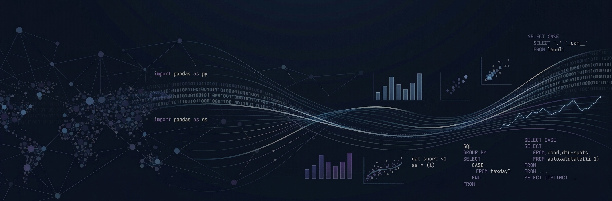

  

 

# Hi, I'm Hanifa Elahi 👋
**Data & Analytics Professional | Transforming Raw Data into Business Impact**

---

# 👩‍💻 About Me

I am a **Data & Analytics professional with 4.5+ years of experience** across product analytics and business intelligence. 

I help teams transform complex and messy datasets into clear decisions, measurable product outcomes, and business impact. My work sits at the intersection of data, product, and strategy—ranging from building KPI dashboards and optimizing SQL pipelines to analyzing user journeys and retention funnels.

**I’m passionate about:**
- Converting raw data into actionable business stories.
- Improving product experiences through behavioral insights.
- Building automated reporting and scalable data workflows.
- Enabling teams to make faster, data-backed decisions.

📍 Karachi, Pakistan (UTC+5) | 📄 [**Resume**]()

---

# 🚀 What I Bring to the Table

* **Product & User Analytics** – Optimize retention, funnel performance, and user journeys through cohort and behavioral analysis
* **Data Analysis & Processing** – Clean, preprocess, and analyze large-scale datasets to extract actionable business insights
* **Dashboarding & Reporting** – Build interactive dashboards and self-serve reporting to facilitate data-driven decision-making
* **SQL & Data Optimization** – High-performance queries and transformation layers
* **CRM & Retention Analytics** – Analyze customer lifecycles to improve acquisition and long-term engagement.
* **Data Engineering & Workflow** – Build ETL pipelines, dbt models, and Python-based workflows to streamline repetitive tasks.
* **Cross-Team Collaboration** – Partner with Product, Marketing, and Leadership teams to integrate data insights into business strategy.

---
  
# 🛠️ Tech Stack

| Category | Tools & Technologies |
| :--- | :--- |
| **Languages & DBs** | `Python` · `SQL` (`MySQL`, `PostgreSQL`, `Trino`, `BigQuery`) |
| **BI & Visualization** | `Power BI` · `Apache Superset` · `Looker Studio` |
| **Data Engineering** | `dbt` · `Apache Spark` · `Mage AI` |
| **Marketing & Analytics** | `Google Analytics` · `Mixpanel` · `Meta Ads` · `Google Ads` |
| **Workflow & Others** | `Git` · `Jupyter` · `Selenium` · `Firebase` · `Notion` · `Excel` |

---

## 📬 Let's Connect

I'm always open to interesting data problems, collaborations, or conversations about analytics.

- **LinkedIn:** [Hanifa Elahi](https://linkedin.com/in/hanifa-elahi-98570a197/)  
- **Kaggle:** [@hanifaelahi](https://kaggle.com/hanifaelahi)  
- **HackerRank:** [@hanifa_elahi](https://www.hackerrank.com/hanifa_elahi)  

